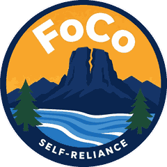

  

<h1 align="center">Self-Reliance FoCo</h1>

A free Android app that puts Larimer County help in one place: food, housing and rent assistance, emergency shelter, jobs, benefits, utility bills, health, transportation, and more. Covers Fort Collins, Loveland, Estes Park, Berthoud, and Wellington.

  

Or scan on your phone: 

## Install on your phone (about 2 minutes)

1. On your Android phone, tap the **Download for Android** button above (or scan the QR code). The file is `Self-Reliance-FoCo.apk`, about 41 MB.
2. When the download finishes, tap the notification (or open your **Files** / **Downloads** app and tap the file).
3. Android will say something like *"For your security, your phone is not allowed to install unknown apps from this source."* Tap **Settings**, turn on **Allow from this source**, then go back.
4. Tap **Install**. If Google Play Protect shows a warning, tap **More details** and then **Install anyway** (this happens for any app that is not from the Play Store).
5. Open **Self-Reliance FoCo** from your home screen.

**Already have Self-Reliance FoCo v1?** You can install this over it. Same app, same key, just a new version.

**Have the older church Self-Reliance app?** Uninstall that one first. Android will not let this install over it.

**iPhone:** this is an Android-only app for now.

## What is in the app (v2.0.0)

- **Resources** tab: 133 listings across food, housing, shelter, jobs, benefits, utilities, health, transportation, phone, legal, seniors and disability, families, veterans, education, and crisis. Search by name, need, or town.
- **Jobs** tab: workforce center, vocational rehab, training, libraries, job boards.
- **Housing** tab: rent help, vouchers, affordable housing, shelters, and utility-bill help, filterable by town.
- Quick-dial **2-1-1** and **9-8-8** on the home screen.
- Tap a number to call, tap a card for hours, address, website, and directions.

No account, no sign-in, no income form, no tracking. The old planning / PDF page is gone.

## Privacy

Nothing you tap is sent anywhere. The app is a local directory.

## Questions or problems

Open an issue on this repo, or reply on the Nextdoor post where you found it. Phone numbers and hours change; if something is wrong, tell us and we will fix the list.

## Checksum (v2.0.0)

To verify your download: `sha256  e2e9a1668b9b20d97026c3f98bcf33f303a6defc471da6f1886240cb14902f0c`
